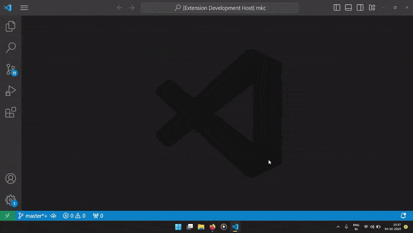

# Trello Kanban Board

[](https://marketplace.visualstudio.com/items?itemName=mayank1513.trello-kanban-task-board) [](https://github.com/mayank1513/vscode-extension-trello-kanban-board/actions/workflows/test.yml) [](https://codeclimate.com/github/mayank1513/vscode-extension-trello-kanban-board/maintainability) [](https://codecov.io/gh/mayank1513/vscode-extension-trello-kanban-board) [](https://marketplace.visualstudio.com/items?itemName=mayank1513.trello-kanban-task-board)

> Organize your work/ideas with Trello like Kanban board!



✅ Supports Markdown - create task description in Markdown

✅ Drag and rearrange tasks and lists

✅ Use global board for workspace independent tasks

✅ Use workspace board specific to the workspace to manage the workspace without clutter

✅ Intuitive drag-and-drop UI

✅ Available for web as well - https://vscode-extension-trello-kanban-board.vercel.app/

## Installation

Install from [VSCode MarketPlace](https://marketplace.visualstudio.com/items?itemName=mayank1513.trello-kanban-task-board) or [Our Website](https://vscode-extension-trello-kanban-board.vercel.app/)

~ OR ~

Search for `trello-kanban-task-board` and install it from the extensions panel in VS Code.

~ OR ~

Open the command palette by pressing `(ctrl+shift+P)` or `F1` and enter the following command:

```bash
ext install trello-kanban-task-board
```

## Usage

`TrelloKanban` offers a global Kanban board and a workspace Kanban board for each workspace.

1. Open the Command Palette by pressing `(ctrl+shift+P)` or `F1`

2. Type `Trello` or `Kanban` or the full command from the table below

3. Select `TrelloKanban: Workspace` or `TrelloKanban: Global` for workspace or global board respectively

   | Name                    | Description                                                  |
   | ----------------------- | ------------------------------------------------------------ |
   | TrelloKanban: Workspace | Opens Kanban Board linked to current workspace (folder)      |
   | TrelloKanban: Global    | Opens global Kanban Board (Not linked to any specific workspace) |

   

# Contribute

You can contribute by creating issues and PRs or by sponsoring my work.

1. Report [issues/bugs](https://github.com/mayank1513/vscode-extension-trello-kanban-board/issues)
2. Join [discussions](https://github.com/mayank1513/vscode-extension-trello-kanban-board/discussions)
3. Star and Fork the [repo](https://github.com/mayank1513/vscode-extension-trello-kanban-board)
4. Sponsor - [GitHub Sponsor](https://github.com/sponsors/mayank1513) Or [Razorpay](https://pages.razorpay.com/mayank1513)

### [🤩 Don't forget to start this repo!](https://github.com/mayank1513/vscode-extension-trello-kanban-board)

[💖](https://github.com/mayank1513/vscode-extension-trello-kanban-board) [🌟](https://github.com/mayank1513/vscode-extension-trello-kanban-board)

Want a hands-on course for getting started with Turborepo? Check out [React and Next.js with TypeScript](https://www.udemy.com/course/react-and-next-js-with-typescript/?referralCode=7202184A1E57C3DCA8B2) and [The Game of Chess with Next.js, React and TypeScrypt](https://www.udemy.com/course/game-of-chess-with-nextjs-react-and-typescrypt/?referralCode=851A28F10B254A8523FE)


## License

Licensed as MIT open source.

<hr />

<p align="center" style="text-align:center">with 💖 by <a href="https://mayank-chaudhari.vercel.app" target="_blank">Mayank Kumar Chaudhari</a></p>
